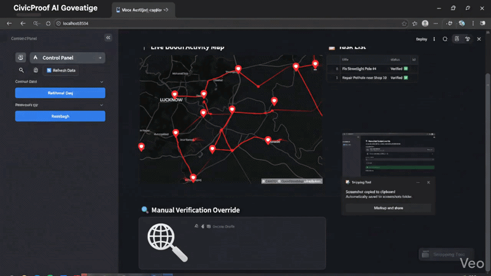
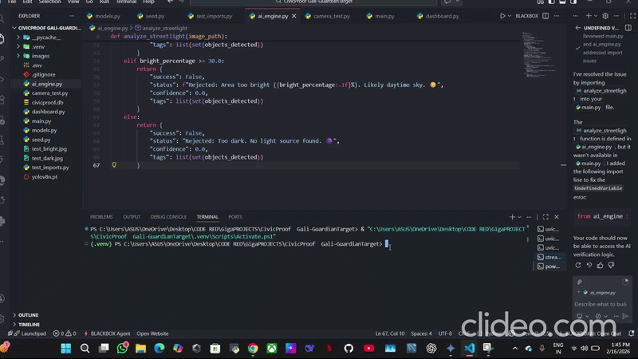

# 🏛️ CivicProof: AI-Driven Micro-Accountability Engine


**[🔴 View Live Demo Here](https://your-live-url-goes-here.com)** *(Note: Replace with your actual deployment link when ready)*

> **Bridging the Trust Deficit between Government Promises and Ground Reality.**

CivicProof is an AI-powered governance platform designed to automate the verification of hyper-local civic works (like streetlight repairs and pothole filling). It forces transparency by requiring field workers to upload visual proof, which is then audited by a Computer Vision AI before marking a task as "Complete" and automatically notifying local citizens.

---

## 🚀 See It In Action

### Real-Time Geospatial Monitoring
*Our dynamic Streamlit dashboard tracking booth-wise activity and task verification in real-time.*


### The AI Engine Under the Hood
*FastAPI backend instantly running YOLOv8 and OpenCV logic to verify uploaded evidence.*


---

## 🛑 The Problem: "Ghost Work"
Local municipalities spend millions on last-mile infrastructure but face a massive "Trust Deficit." 
* 📉 **Lack of Verification:** Authorities cannot physically inspect thousands of daily micro-tasks.
* 👻 **Fake Reporting:** Contractors often mark jobs as "Complete" without actually doing the work.
* 🔇 **Citizen Disconnect:** Residents see broken infrastructure, report it, but never receive transparent updates.

## 💡 The Solution: Visual Proof Protocol
CivicProof replaces manual checks with an **Automated Trust Loop**:
1. **Assign 📍:** A task (e.g., "Fix Streetlight") is assigned to a local booth.
2. **Execute & Upload 📸:** The worker finishes the job and uploads a photo to the portal.
3. **AI Audit 🧠:** The YOLOv8 + OpenCV engine analyzes the image for context (is it a street?) and execution (is the light actually glowing?).
4. **Notify 📲:** Once verified, the system automatically sends an SMS notification to the specific voters registered in that booth area.

---

## ✨ Key Features
* 🔍 **Smart Glare Detection (Computer Vision):** Custom blob-detection algorithms distinguish between a working lightbulb and a bright daytime sky, preventing "false positive" verifications.
* 🗺️ **Geospatial War Room:** A real-time dashboard providing authorities with a heat map of pending vs. verified complaints.
* 🔄 **Automated Citizen Loop:** Closes the feedback loop by linking verified tasks directly to the voter registry database for localized updates.
* 🛡️ **Fraud Prevention:** Automatically rejects dark, blurry, or context-inaccurate photos.

---

## 📸 System Previews

### 1. The Command Center Dashboard
*Real-time metrics, geospatial booth mapping, and task tracking.*


### 2. Live Activity Map
*Monitoring task statuses (Pending, Verified, Rejected) across different city zones.*


---

## 🛠️ Technology Stack
* **Backend:** `Python`, `FastAPI`, `Uvicorn`
* **AI/Machine Learning:** `Ultralytics YOLOv8` (Object Detection), `OpenCV` (Luminosity/Blob Analysis), `NumPy`
* **Database:** `SQLite` & `SQLAlchemy` (Knowledge Graph modeling of Voters ↔ Booths ↔ Tasks)
* **Frontend:** `Streamlit`, `Pandas`

---

## 💻 Quick Start Guide (Local Deployment)

### Prerequisites
* Python 3.9+
* Git

### Installation Steps

1. **Clone the repository:**
   ```bash
   git clone [https://github.com/yourusername/CivicProof.git](https://github.com/yourusername/CivicProof.git)
   cd CivicProof
   ```
   
2.  **Install dependencies:**

    ```bash
    pip install -r requirements.txt
    ```

3.  **Initialize and Seed the Database:**
    *This creates a local SQLite database and populates it with dummy booths, voters, and tasks.*

    ```bash
    python seed.py
    ```

4.  **Start the FastAPI Backend:**

    ```bash
    uvicorn main:app --reload
    ```

    *The API will be live at `http://127.0.0.1:8000` (Access the Swagger UI at `/docs`).*

5.  **Launch the Streamlit Dashboard:**
    *Open a new terminal window and run:*

    ```bash
    streamlit run dashboard.py
    ```

    *The dashboard will automatically open in your browser.*

-----

## 🤝 Open for Collaboration

This project is open-source and looking for contributors! Areas where we'd love your help:

  * 🎨 **Frontend Polish:** Enhancing the Streamlit UI with custom CSS and better Map integrations (Folium).
  * 🧠 **AI Expansion:** Training custom YOLO models to detect specific civic issues like garbage dumps, potholes, and waterlogging.
  * 🔐 **Security:** Implementing EXIF GPS data extraction to ensure uploaded photos match the exact task coordinates.

Feel free to **Fork** the repository and submit a **Pull Request**!

-----

<p align="center">
<i>Developed for robust, transparent, and hyper-local governance.</i>
</p>

-----

### Essential Steps for a Professional Manual Upload

To make sure this renders perfectly on GitHub, double-check these steps when uploading:

1.  **Root Directory Placement:** Ensure your `README.md`, `main.py`, `dashboard.py`, `ai_engine.py`, `seed.py`, and `requirements.txt` are all sitting directly in the main folder of your repository.
2.  **Image Placement:** Because of how the markdown is written above, the images and GIFs (`Screenshot 2026-02-16 134807.png`, `EditCivicPGIF.gif`, etc.) must be uploaded to the **exact same main folder** as the README. If you put them in an "images" folder, the links will break unless you update the markdown to say `images/EditCivicPGIF.gif`.
3.  **The `.gitignore` File:** Manually create a file named exactly `.gitignore` (with the dot) in your GitHub repo and add `*.db` and `__pycache__/` to it. This shows recruiters you know how to keep repositories clean of unnecessary system files.
4.  **Update the URL:** Don't forget to replace `https://your-live-url-goes-here.com` at the top of the README once you eventually host it online (like on Render or Streamlit Community Cloud).
